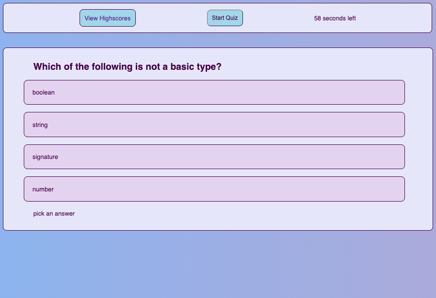

# Coding Quiz

## by Charlotte Clark

## Technologies Used

* HTML
* CSS
* Javascript

## How to use:

When you click the "Start Quiz" button - a timer will begin counting down from 120 seconds, and the first quiz question, and its corresponding answer choices will appear. 
When you answer the first question, the second question will appear. 
If you answer incorrectly, time will be deducted (lowering your score). 
Once you have answered all questions are answered or the timer reaches 0, then the game is over. 
When the game is over, then you can save your initials and see your score.
---
link: https://charlocc.github.io/codingquiz/
---

## Licensing

The MIT License (MIT)

Copyright (c) 2021 Charlotte Clark

Permission is hereby granted, free of charge, to any person obtaining a copy of this software and associated documentation files (the "Software"), to deal in the Software without restriction, including without limitation the rights to use, copy, modify, merge, publish, distribute, sublicense, and/or sell copies of the Software, and to permit persons to whom the Software is furnished to do so, subject to the following conditions:

The above copyright notice and this permission notice shall be included in all copies or substantial portions of the Software.

THE SOFTWARE IS PROVIDED "AS IS", WITHOUT WARRANTY OF ANY KIND, EXPRESS OR IMPLIED, INCLUDING BUT NOT LIMITED TO THE WARRANTIES OF MERCHANTABILITY, FITNESS FOR A PARTICULAR PURPOSE AND NONINFRINGEMENT. IN NO EVENT SHALL THE AUTHORS OR COPYRIGHT HOLDERS BE LIABLE FOR ANY CLAIM, DAMAGES OR OTHER LIABILITY, WHETHER IN AN ACTION OF CONTRACT, TORT OR OTHERWISE, ARISING FROM, OUT OF OR IN CONNECTION WITH THE SOFTWARE OR THE USE OR OTHER DEALINGS IN THE SOFTWARE.

